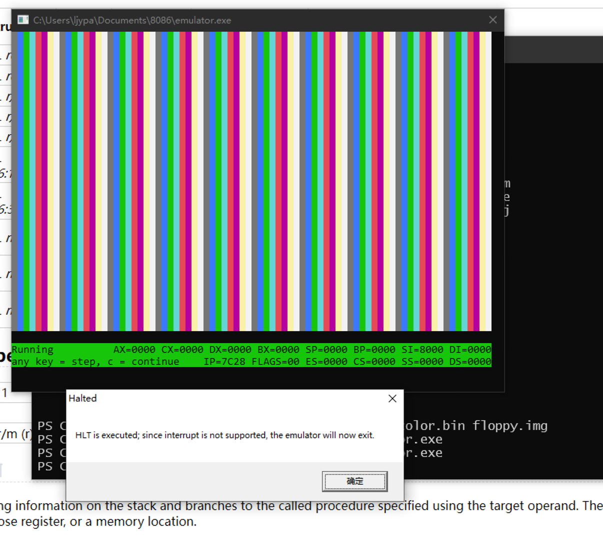

# 说明文档

## 小组分工

+ @panda2134：

  CALL, JMP, RET, Jcc, STC, CLC, HLT

  TUI界面（含模拟器显存渲染）

  模拟器加载可执行文件

  测试程序

  OllyDbg调试

+ @YouJiacheng：

  Effective Address Computation及其单元测试

  ADD, OR, ADC, SBB, AND, SUB, XOR, CMP

  INC, DEC, MOV, XCHG, PUSH, POP

  代码优化

  代码人工静态检查

  整理8086机器码文档

## 效果展示

- 运算测试，从 [CodeGolf](https://codegolf.stackexchange.com/questions/4732/emulate-an-intel-8086-cpu) 下载并汇编得到（对显示稍做了修改以适应真实显存布局），测试效果如下图：
  
- 显存颜色测试，用于测试虚拟 CGA 80x25 显示的颜色效果，如下图：
  

## 开发环境

- Windows 10
- MASM32 
- OllyDbg
- Visual Studio Code, Git

## 功能实现

### 功能简介

实现了支持大部分常用指令的8086模拟器

完全支持指令（不支持前缀，如Segment Override Prefix）

+ ADD, OR, ADC, SBB, AND, SUB, XOR, CMP
+ INC, DEC
+ MOV
+ XCHG
+ PUSH, POP
+ CALL, JMP, RET, Jcc(All Conditional Jump Instructions)
+ CLC, STC
+ HLT

尚未实现的重要指令

+ INT, INTO
+ IN, OUT
+ TEST
+ SAHF, LAHF
+ NOT, NEG, MUL, IMUL, DIV, IDIV
+ SHL/SAL(same op), SHR, SAR
+ ROL, ROR, RCL, RCR
+ LEA

### 实现原理与难点

由于现代x86/x86_64处理器支持的指令是8086的超集，指令的实现较为简单。

困难之处在于指令的解码、尤其是高效的解码，如何减少内存访问次数、减少数据传送次数（尽管现代处理器可通过register renaming实现zero latency reg to reg mov）、减少跳转次数、减少处理器在关键路径上的Stall周期数、减少关键路径的周期数。同时还需作出取舍，牺牲部分性能换取更高的代码可复用性和更小的二进制文件。

为了实现高效解码，我们采取了多种策略

+ 用位运算计算索引代替条件跳转和读取，消除了部分不可预测的分支
  + 这需要合适的虚拟机数据布局配合
+ 用xor+test代替and+cmp实现部分位匹配，从而只需读取一次数据便可进行多次对不同部分的位匹配，对虚拟机同一数据的访问次数降低为最多1次
+ 用位运算+跳转表代替条件跳转
+ 在避免Partial Register Stalls的前提下，拆分利用寄存器，不使用任何栈上变量，极大减少了内存访问次数，一次解码除了必要的对虚拟机数据的访问和ret，内存访问次数为0

为了实现代码复用，我们也采取了多种策略

+ 类似指令的大段共同逻辑尽可能共用，即使因此付出少量的额外条件分支代价
  + 如果不共用逻辑，初始分支后便不再交汇，从而无需再次条件分支
+ 多次重复的小段逻辑提炼为宏
+ Effective Address计算几乎使用了所有寄存器，为减少call+ret的额外开销（需访问内存）、使代码具有局域性对指令预取和缓存友好，以宏的形式实现代码复用

由于Effective Address计算被多处使用且逻辑较为复杂，为了降低测试与调试难度，我们为Effective Address计算编写了单元测试。

实践表明，除了一处Specification整理错误导致的单元测试用例错误，Effective Address计算在通过单元测试后没有出现任何错误。

> Specification
>
> r/m
>
> 000 BX + SI + Disp
>
> 001 BX + DI + Disp
>
> 010 BP + SI + Disp
>
> 011 BP + DI + Disp
>
> 100 SI + Disp
>
> 101 DI + Disp
>
> 110 BP + Disp
>
> 111 BX + Disp
>
> 正确整理
>
> r/m = 0,b,i
>
> r/m = 1,0,i
>
> r/m = 1,1,~b
>
> Base = b ? BP : BX
>
> Index = i ? DI : SI
>
> 错误整理
>
> r/m = 0,b,i
>
> r/m = 1,0,i
>
> r/m = 1,1,b
>
> 若不细致，很难发现仅有Base的情况和Base、Index兼具的情况对Base的Encode竟然是相反的
