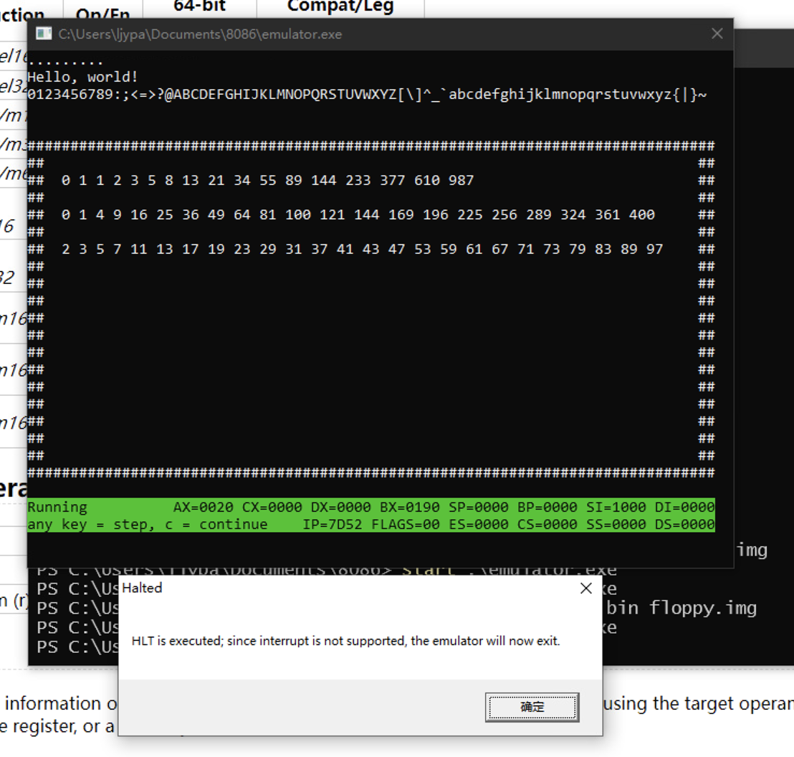

# 使用方法

汇编并链接 `emulator.asm` 得到 `emulator.exe`，其运行时会在同目录下寻找 `floppy.img` 文件，该文件需要符合x86 可启动软驱的格式，虚拟机只会在检测到可启动标识（510字节处的AA55）时载入MBR扇区进行运行。

按照8086的标准，开始执行位点为 0000:7c00，若要自行编译代码运行，除了需要注意采用我们支持的指令集合外，还要注意采用 ORG 指令对代码标签进行偏移。

默认提供的 `floppy.img` 为一个简单的测试程序，在检查几条基本指令的处理正确性后，计算并显示一些数列。

## 测试用可执行文件

把要运行的文件重命名为 `floppy.img` 放到模拟器同目录即可。

- 运算测试，从 [CodeGolf](https://codegolf.stackexchange.com/questions/4732/emulate-an-intel-8086-cpu) 下载并汇编得到（对显示稍做了修改以适应真实显存布局），测试效果如下图：
  
- 显存颜色测试，用于测试虚拟 CGA 80x25 显示的颜色效果，如下图：
  

## 调试功能

在进入模拟器时默认为调试模式，可以对照着清单文件查看代码执行情况，按任意键（除了c）单步执行；
若要继续执行直到HLT，按c键。